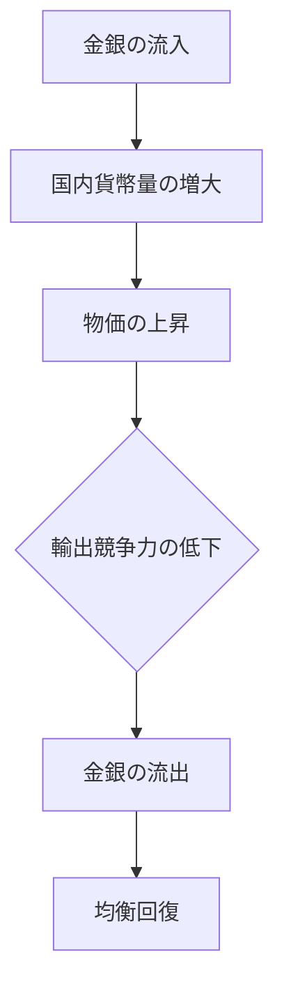

# 古典派経済学の理論体系：学術的参照のための詳説

**まえがき：古典派経済学の射程とパラダイム**

本書は、1776年のアダム・スミス『国富論』から1848年のJ.S.ミル『政治経済学原理』に至る、いわゆる「古典派経済学」の理論的達成を体系的に記述するものである。古典派は、市場を単なる効率的な交換の場としてではなく、階級間の分配と資本蓄積による歴史的・動態的なプロセスとして捉えた。その分析は、現代のミクロ・マクロ経済学の分離以前の「政治経済学（Political Economy）」としての統合的な視座を持っており、富の源泉、価値の決定、そして社会の長期的趨勢を解明しようとした壮大な試みであった。

---

## 第1回：経済学の夜明け ― 重商主義批判と自然的秩序の発見

### 1.1 重商主義（Mercantilism）の論理と限界
16世紀から18世紀にかけてヨーロッパを支配した重商主義は、国家の富を「金銀の蓄積量」と同一視した。そのため、輸出を最大化し輸入を抑制する保護貿易政策、植民地搾取、独占権の付与が正当化された。この世界観では、貿易は一方が得をすれば他方が損をする「ゼロサム・ゲーム」であった。

### 1.2 ヒュームによる価格・正貨流出入メカニズム
デイヴィッド・ヒュームは、正貨（金銀）の蓄積が恒久的な富をもたらさないことを数理的に論証した。金銀が流入すれば国内貨幣量が増大し、物価が上昇する。その結果、輸出競争力が低下し、逆に輸入が増大するため、蓄積された金銀は再び流出する（**正貨流出入メカニズム**）。この発見は、貨幣が富の本質ではなく、生産物のフローこそが重要であるというパラダイムシフトを導いた。

### 1.3 重農主義（Physiocracy）の影響
ケネーを中心とする重農主義者は、農業のみが「純生産（剰余）」を生むと考え、『経済表』において社会の富の循環を解明しようとした。古典派は、この「富の循環」と「余剰」という概念を継承し、それを工業も含めた全産業へと拡張していくことになる。

---

## 第2回：アダム・スミス(1) ― 『道徳感情論』と『国富論』の接合

### 2.1 同感（Sympathy）と市場の倫理
スミスの「見えざる手」は、しばしば「無制約な利欲の肯定」と誤解される。しかし、彼の主著『道徳感情論』によれば、人間の行動は「公平な観察者」による「同感」によって抑制される。市場における競争が社会的な厚生をもたらすためには、正義の諸規則（他者の身体・財産の侵害禁止）というインフラが不可欠であった。

### 2.2 利己心と公共の利益
> 「我々が食事を期待できるのは、肉屋や酒屋やパン屋の慈悲心からではなく、彼ら自身の利益に対する配慮からである」

この有名な一節は、個人の利益追求が意図せざる結果として社会全体の富を増大させるメカニズムを指摘している。ここでの鍵は「自由な競争」であり、競争が機能する限り、価格は資源の希少性を反映し、最適な配分を実現する。

### 2.3 自然的自由の体系
スミスは、重商主義的な介入（関税、補助金、独占）が資源配分を歪め、国民の富を損なうと主張した。彼が唱えた「安価な政府」は、国防、司法、および個人では採算の取れない公共事業（教育や社会資本）に役割を限定するものであった。

---

## 第3回：アダム・スミス(2) ― 分業論と資本蓄積の動態的循環

### 3.1 分業（Division of Labour）の三つの効用
『国富論』の冒頭を飾る分業論は、ピン工場の例を引いてその生産性向上を説く。
1.  労働者の習熟度の向上。
2.  作業転換に伴う損失時間の節約。
3.  労働を支援・代替する機械の発明。

分業は「市場の広さ」によって制限されるため、自由貿易による市場拡大が更なる分業と成長を促す。

### 3.2 生産的労働と非生産的労働
スミスは資本蓄積を重視し、労働を二分した。
- **生産的労働**： 資本に価値を付加し、形ある商品を生産する労働（工場労働者など）。
- **非生産的労働**： サービスとして消費され、将来の富を生まない労働（家僕、官吏、軍人など）。
一国の富が増大するかどうかは、生産的労働者の比率、すなわち「節約（貯蓄）」がいかに投資（資本蓄積）に向けられるかに依存する。

---

## 第4回：価値論の相克 ― 労働価値説の論理構造とパラドックス

### 4.1 使用価値と交換価値（水とダイヤモンドのパラドックス）
スミスは「水とダイヤモンドのパラドックス」を提示した。生存に不可欠な水は安く、不要なダイヤが高いのはなぜか。古典派はこれを「限界」の概念なしに、生産に要する「コスト」で説明しようとした。

### 4.2 支配労働価値説から投下労働価値説へ
- **支配労働価値説（スミス）**： ある商品がどれだけの労働を買うことができるか。初期社会では成立するが、資本蓄積後は利潤と地代が加わるため、この尺度は不安定になる。
- **投下労働価値説（リカード）**： 商品の価値は、その生産に直接・間接（道具や機械）に費やされた労働量によって決定される。リカードは、資本の構成（機械と労働の比率）が異なっても、長期的には投下労働量が価格の主軸になると考えた。

### 4.3 自然価格（Natural Price）の重力
市場価格は一時的に需給で変動するが、常に「生産費（賃金・利潤・地代）」を賄う**自然価格**へと回帰する。この「重力メカニズム」が古典派の市場均衡の基礎である。

---

## 第5回：T.R.マルサス ― 人口の原理と有効需要の欠如

### 5.1 『人口論』と「マルサスの罠」
人口は**幾何級数的**（1, 2, 4, 8...）に増加するが、食糧生産は**算術級数的**（1, 2, 3, 4...）にしか増加しない。この不均衡は、戦争・疫病・飢饉（積極的抑止）や、晩婚・禁欲（予防的抑止）によって調整される。この悲観的な見通しにより、労働者の賃金は常に生存最低限（Subsistence level）に抑え込まれるという「**賃金の鉄則**」が導かれた。

### 5.2 有効需要論争
リカードが「セイの法則」を信じたのに対し、マルサスは「一般的過剰生産」の可能性を指摘した。資本家が過度に節約し投資すると、生産物は増えるがそれを買う消費能力が不足する。マルサスは、地主階級などの「非生産的消費者」による消費が、恐慌を防ぐために必要だと説いた。これは後のケインズによる有効需要理論の先駆けとなる。

---

## 第6回：D.リカード(1) ― 差額地代説と収穫逓減の法則

### 6.1 土地の有限性と肥沃度の差
リカードは、経済成長に伴う人口増が、より質の悪い土地（劣等地）の耕作を強いる点に着目した。
- **収穫逓減の法則**： 同じ労働・資本を投入しても、劣等地では収穫量が減る。
- **差額地代**： 最も条件の悪い土地（限界地）では地代が発生せず、それより肥沃な土地が限界地に対して持つ生産性の差が「地代」として地主に帰属する。

### 6.2 地代の非構成的性格
リカードは「穀物価格が高いから地代が高いのではない。地代を払わねばならないから穀物価格が高いのでもない。穀物価格が高いから、地代が支払われるのである」と断じた。地代は価格を決定する費用ではなく、価格から生まれる剰余である。

---

## 第7回：D.リカード(2) ― 分配理論と利潤率の低下傾向

### 7.1 分配の対立構造
リカードの関心は「総生産物が階級間でいかに分配されるか」にあった。
1.  **名目賃金の上昇**： 劣等地の耕作により食糧価格が上がると、労働者の生存を維持するために名目賃金を上げざるを得ない。
2.  **利潤の圧迫**： 総生産から地代と賃金を差し引いた残りが利潤（Profit）である。地代と賃金が上昇すれば、資本家の利潤は必然的に低下する。

### 7.2 定常状態（Stationary State）への行進
利潤が極限まで低下し、新たな投資のインセンティブが消滅した時、資本蓄積は止まり、人口増も止まる。古典派はこれを資本主義の最終到達点と見なした。

---

## 第8回：D.リカード(3) ― 比較生産費説の数理的証明

### 8.1 比較優位の原理（Comparative Advantage）
絶対的な生産力が低くても、他国に比べて「相対的に」得意な財に特化すれば、双方に利益があることを証明した。

$$ \frac{\text{A国の財1労働投入}}{\text{A国の財2労働投入}} < \frac{\text{B国の財1労働投入}}{\text{B国の財2労働投入}} $$

この比率の差がある限り、特化と貿易によって世界全体の生産可能性フロンティアは拡大する。

### 8.2 穀物法論争と政治経済学
リカードは、安価な外国産穀物の輸入を制限する「穀物法」を激しく批判した。輸入を自由化すれば食糧価格が下がり、賃金コストが抑制され、資本家の利潤が回復して定常状態への移行を遅らせることができる。これは産業資本家と地主階級の政治的対立の理論的武器となった。

---

## 第9回：J.B.セイ ― 貨幣のベール観とマクロ均衡

### 9.1 セイの法則（Say's Law）
「**供給はそれ自体の需要を創出する**」。
商品の生産はそれと同額の所得を生むため、社会全体では買い手不在の売れ残りは生じないという考え。

### 9.2 貨幣のベール
貨幣は交換を媒介する一時的な手段に過ぎず、本質は商品と商品の交換である。不況は「局部的な需給のミスマッチ（ある商品が売れ残り、ある商品が足りない）」に過ぎず、全商品が同時に売れ残ることはないとした。

---

## 第10回：J.S.ミル(1) ― 古典派の集大成と分配の柔軟性

### 10.1 生産法則と分配法則の峻別
ミルは『政治経済学原理』において、古典派理論を統合した。
- **生産法則**： 物理的な自然法則に支配される（変更不可能）。
- **分配法則**： 人間が作った社会的な制度や慣習によって決まる（変更可能）。

これにより、資本主義を維持しつつも、累進課税や相続制限によって格差を是正する「社会改良主義」への道を開いた。

### 10.2 相互需要の法則
リカードが比較生産費説で示した「貿易の利益」が、具体的にどのような比率で分配されるか（国際価格の決定）を、両国の需要の強さの相関で説明した。

---

## 第11回：J.S.ミル(2) ― 定常状態の哲学的転換

### 11.1 成長停止の肯定的評価
リカードが定常状態を「資本主義の敗北」のように捉えたのに対し、ミルはこれを肯定的に評価した。
> 「富が増大しなくなったというだけで、人間の精神的な進歩が止まると考えるのは誤りである」

物質的な拡大が止まることで、人間は教養、芸術、社会正義、そして環境との共生に時間を割くことができる。これは現代の「脱成長」や「ウェルビーイング」の議論の直接の祖形である。

---

## 第12回：限界革命 ― 客観的価値論から主観的価値論へ（新古典派の誕生）

### 12.1 1870年代のパラダイムシフト
ジェヴォンズ、メンガー、ワルラスによる「限界革命」は、古典派の根幹を否定した。
- **投下労働価値説の否定**： 「かかった苦労（コスト）」が価値を決めるのではなく、「これから得られる満足（効用）」が価値を決めると再定義。
- **限界原理**： 価値を決定するのは総量ではなく、最後の一単位がもたらす「限界効用」である。

### 12.2 なぜ新古典派へ移行したのか
1.  **数学化の要請**： 微分積分を用いた最適化問題として経済を記述するためには、連続的な効用関数が必要だった。
2.  **需要側の重視**： 供給力が増大し、消費者の選択が重要になるにつれ、主観的な満足度が分析の中心となった。
3.  **階級から個人へ**： 社会を「階級の闘争」として見る古典派に対し、新古典派は「合理的な個人（ホモ・エコノミクス）」の選択の集計として経済を捉え直した。

---

## 第13回：批判的継承 ― マルクスにおける古典派の解体

### 13.1 労働力の価値と剰余価値
マルクスはリカードの労働価値説を徹底的に突き詰めた。
- **労働力の商品化**： 資本主義では「労働」そのものではなく、労働者の「働く能力（労働力）」が売買される。
- **搾取の構造**： 労働力の価値（生活費）以上の価値を労働者が生産し、その差額（剰余価値）を資本家が着服する。マルクスにとって、古典派が「調和」と呼んだ市場は「搾取の場」であった。

### 13.2 古典派の歴史的制約
マルクスは、スミスやリカードが「資本主義の法則」を「自然の法則（不変のもの）」と見なした点を批判した。彼は、古典派の法則は資本主義という特定の歴史的段階にのみ通用する相対的なものだと主張した。

---

## 第14回：総括 ― 現代経済学における古典派の遺産

### 14.1 サプライサイドと新自由主義
「セイの法則」や「小さな政府」の思想は、20世紀後半のサプライサイド経済学や新自由主義として蘇った。規制緩和や減税による供給力の強化が経済を活性化させるという主張の根底には、常にスミス的な自由主義が流れている。

### 14.2 持続可能性と定常状態の再発見
気候変動や資源の枯渇に直面する現代において、ミルの「定常状態論」は、エコロジー経済学や脱成長論として再評価されている。無限の拡大が不可能な閉鎖系（地球）において、いかにして定常的な豊かさを維持するかという問いは、古典派が最後に残した最大の宿題である。

---

### 結語
古典派経済学を学ぶことは、経済学の「起源」を辿るだけでなく、我々が当然視している「市場」「価値」「成長」といった概念がいかに歴史的に構築されたかを理解する行為である。新古典派のような精密な数学的証明は持たなかったが、古典派が持っていた「社会全体を俯瞰するダイナミックな視点」は、現代においてもなお、その輝きを失っていない。

*Edited and compiled by Agent Antigravity*
