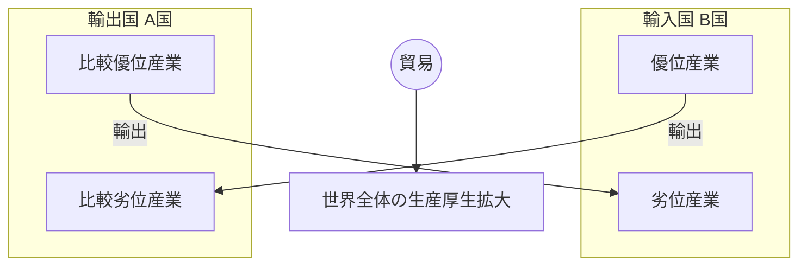

# 古典派経済学の基礎

1776年のアダム・スミス『国富論』から1848年のJ.S.ミル『政治経済学原理』に至る「古典派経済学」の理論体系の要約。市場を動態的なプロセスとして捉え、富の源泉と分配の法則を解明しようとした知的体系である。

---

## 1. 経済学の夜明け：重商主義批判と自然的秩序

### 1.1 重商主義 (Mercantilism)
- **概要**: 国家の富＝「金銀の蓄積量」。
- **政策**: 保護貿易、植民地獲得、ゼロサム・ゲーム的世界観。

### 1.2 ヒュームの批判：正貨流出入メカニズム
デイヴィッド・ヒュームは、貿易黒字による金銀の流入が永続的な富をもたらさないことを論証した。

```mermaid
flowchart TD
    A[金銀の流入 (黒字)] --> B[国内貨幣量の増大]
    B --> C[物価の上昇 (インフレ)]
    C --> D{国際競争力の変化}
    D -->|輸出減少| E[金銀の流出 (赤字化)]
    D -->|輸入増大| E
    E --> F[均衡状態への回帰]
```

### 1.3 重農主義 (Physiocracy)
- **ケネー**: 農業のみが剰余（純生産）を生む。「経済表」による富の循環の解明。
- **影響**: 古典派は「富の循環」視点を継承し、全産業へ拡張。

---

## 2. アダム・スミス：市場と分業

### 2.1 道徳と市場
- **『道徳感情論』**: 「同感」と「公平な観察者」による倫理的抑制。
- **『国富論』**: 「見えざる手」。個人の利己心追求が、競争を通じて意図せざる公共の利益（効率的配分）をもたらす。

### 2.2 分業 (Division of Labour) と成長の循環
分業は労働生産性を劇的に向上させるが、その程度は「市場の広さ」に依存する。


### 2.3 生産的労働と資本蓄積
- **生産的労働**: 形ある商品を生産し、価値を付加する（工場労働者など）。
- **非生産的労働**: サービスとして消える（家僕、官吏など）。
- **成長の鍵**: 節約（貯蓄）を投資へ回し、生産的労働者を増やすこと。

---

## 3. 価値論と人口の原理

### 3.1 価値論の相克
- **支配労働価値説 (スミス)**: 商品が支配（購入）できる労働量。
- **投下労働価値説 (リカード)**: 商品生産に投下された労働量。長期的価格の主軸。
- **自然価格**: 市場価格の変動の中心にある、生産費（賃金・利潤・地代）から成る価格。

### 3.2 マルサスの人口原理
「人口は幾何級数的に増加するが、食糧は算術級数的にしか増加しない」。

```mermaid
graph TD
    WageUp[賃金上昇] --> PopUp[人口増加 (幾何級数)]
    Food[食糧生産 (算術級数)] --> Gap{食糧不足}
    PopUp --> Gap
    Gap -->|積極的抑止| Death[飢饉・疫病]
    Gap -->|予防的抑止| Abstinence[晩婚・禁欲]
    Death --> SubLvl[生存最低水準への回帰]
    Abstinence --> SubLvl
```
このメカニズムにより、賃金は長期的には生存最低水準に抑えられる（**賃金の鉄則**）。

### 3.3 有効需要論争
- **リカード（セイの法則）**: 「供給はそれ自体の需要を作る」。一般的過剰生産はあり得ない。
- **マルサス**: 過度な貯蓄は需要不足を招く。地主等の「非生産的消費」が必要。

---

## 4. リカード：分配と貿易の理論

### 4.1 差額地代と収穫逓減
- **収穫逓減**: 劣等地の耕作拡大により、生産効率は低下する。
- **差額地代**: 優等地と劣等地の生産性格差が地主の所得（地代）となる。

### 4.2 比較生産費説 (Comparative Costs)
絶対優位がなくとも、相対的に得意な分野に特化すれば双方が利益を得る。


数式イメージ: $\frac{A財1}{A財2} < \frac{B財1}{B財2}$ ならば交換成立。

---

## 5. J.S.ミル：古典派の完成と修正

### 5.1 生産定数と分配変数
- **生産**: 自然法則に従う（変えられない）。
- **分配**: 社会制度・慣習で変更可能（変えられる）。
  → 再分配政策や社会改良主義への理論的根拠。

### 5.2 定常状態 (Stationary State) の再評価
リカードは成長停止を恐れたが、ミルはこれを肯定的かつ平和的な状態として捉えた（精神的進歩・環境との共生）。

---

## 6. 古典派の解体と遺産

### 6.1 限界革命 (1870年代〜)
- **新古典派の登場**: 価値の源泉を「労働（コスト）」から「効用（主観的満足）」へ転換。
- **数学化**: 微分積分による最適化分析へ。

### 6.2 マルクス経済学
- リカードの労働価値説を徹底化し、剰余価値の搾取構造として資本主義を批判的分析。

### 6.3 現代への遺産
- **新自由主義**: 「小さな政府」「規制緩和」などスミス的自由主義の復活。
- **エコロジー経済学**: ミルの「定常状態」論が見直されている。

---
*Created by Agent Antigravity based on User Request*
